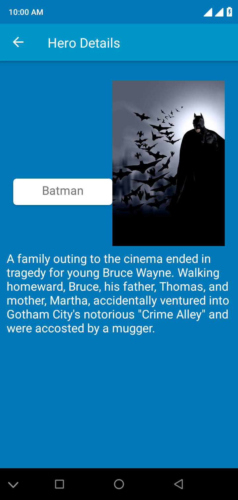

# SuperHero
Simple Superhero app using preloaded data inserted into room database with MVVM architecture, coroutines and navigation component

### Architecture/Tools and Libraries
1. Mvvm
2. Room db
3. Coroutines
4. Navigation components 

### Screenshots

 
 

 
